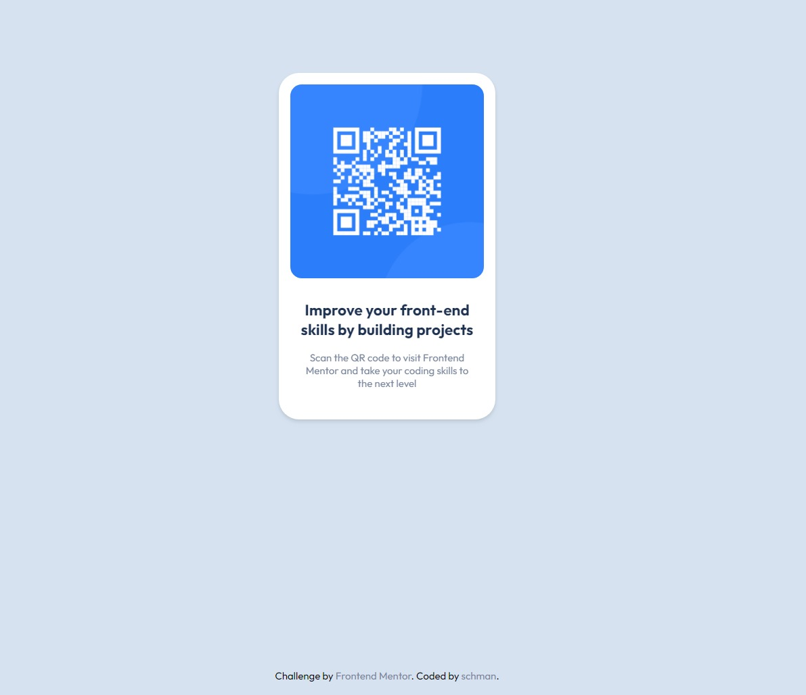

# Frontend Mentor - QR code component solution

This is a solution to the [QR code component challenge on Frontend Mentor](https://www.frontendmentor.io/challenges/qr-code-component-iux_sIO_H). Frontend Mentor challenges help you improve your coding skills by building realistic projects.

## Table of contents

- [Overview](#overview)
  - [Screenshot](#screenshot)
  - [Links](#links)
- [My process](#my-process)
  - [Built with](#built-with)
  - [What I learned](#what-i-learned)
  - [Continued development](#continued-development)
  - [Useful resources](#useful-resources)
- [Author](#author)

## Overview

### Screenshot

### Links

- [live site url]: (https://frontendmentor-io-qr-code-component.vercel.app/)

## My process

### Built with

- Semantic HTML5 markup
- CSS custom properties
- Flexbox

### What I learned

Since I'm using [TailwindCSS](https://tailwindcss.com) it was a little challenge to write normal CSS. I'm using CSS custom properties for the firsttime. I think I have to learn how to structe CSS custom properties to use it efficiently. I also learned to convert px values to rem. I used only rem for all (font-size, padding, margin, ...)

### Continued development

I try to improve to use of CSS custom properties (nameing).

### Useful resources

- [TailwindCSS Documentation](https://www.tailwindcss.com/docs) - This helped me wirte normal CSS.

## Author

- Website - [schman](https://www.schman.at)
- Frontend Mentor - [@schmanat](https://www.frontendmentor.io/profile/schmanat)
